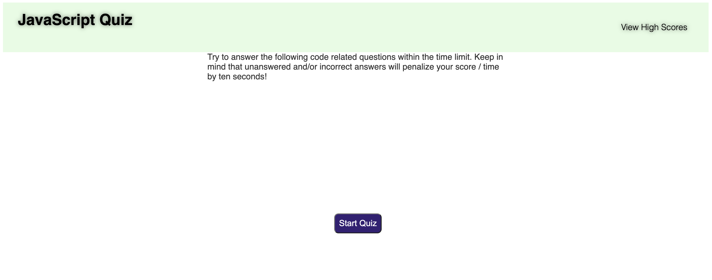
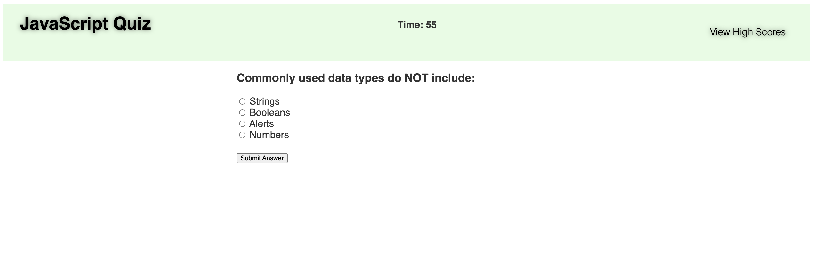
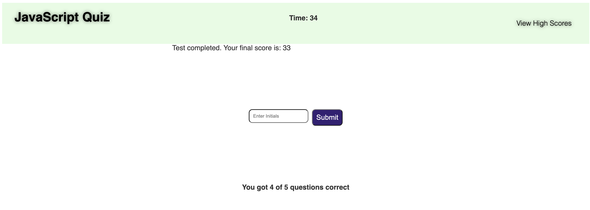
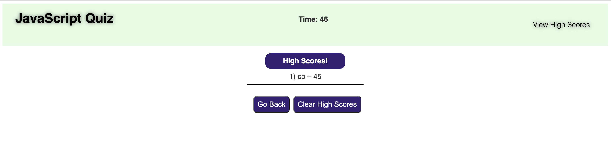

# Javascript-Quiz

This application will test your knowledge of javascript and html! Answer the questions under the time alloted. Every incorrect question or unanswered question will substract 10 seconds from the timer. At the end you can save your final score.

# User Story

AS A coding boot camp student
I WANT to take a timed quiz on JavaScript fundamentals that stores high scores
SO THAT I can gauge my progress compared to my peers

# Acceptance Criteria

GIVEN I am taking a code quiz
WHEN I click the start button
THEN a timer starts and I am presented with a question
WHEN I answer a question
THEN I am presented with another question
WHEN I answer a question incorrectly
THEN time is subtracted from the clock
WHEN all questions are answered or the timer reaches 0
THEN the game is over
WHEN the game is over
THEN I can save my initials and score

# Technologies used

* HTML
* CSS
* Jaavascript

# Screenshots

* Welcome screenshot

  
  
* Quiz screenshot

  
  
* Score screenshot

  
  
* Stored score screenshot

  

*  The **URL of the GitHub repository** that contains the code: (https://github.com/ciyer87/Javascript-Quiz) 
*  The **URL of the deployed application**: (https://ciyer87.github.io/Javascript-Quiz/)
